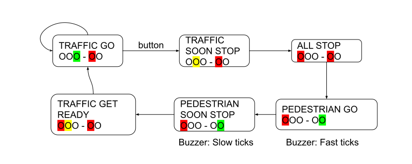

# The Traffic Light

In this assignment we aim to work with more code and more components. We apply the things we have learned so far, more of the same but with less instructions and guidance. 

## Rules

This task is going to be conducted in a group of TWO students. Both students must be active during all steps of the assignment.

ALERT! DURING THIS ASSIGNMENT
NONE OF THE ARTIFACTS FROM THIS ASSIGNMENT MAY BE SHARED WITH OTHER STUDENT GROUPS.
YOU MAY NOT ASK FOR HELP FROM OTHER STUDENT GROUPS, THINK OF THIS AS AN EXAM. 
YOU MAY GET HELP FROM A TEACHING ASSISTANT OR THE TEACHER.

## Knowledge Components
 * Apply knowledge components from previous assignments. 

## Ingredients

### Hardware
 * Six LED's with resistors (2 x Red, 2 x yellow, 2 x green)
 * Buzzer with resistor
 * Button with resistor
 
 
## Steps

### Step 1. Build Check all components

We are going to build a traffic light that can sit next to a pedestrian crossing. Thus it has three LEDs for traffic, two LEDs for the pedestrian crossing, and a button circuit used by pedestrians to ask for green light. 

Build one circuit at a time and test before continuing to the next
* a traffic light (Red, Yellow, Green - LEDs with resistors), 
* a pedestrian crossing light (Red, Green - LEDs with resistors) and a Buzzer
* a pedestrian button (button circuit and yellow LED with resistors). The LED is lit when button has been pressed and is turned of when green light is given to the pedestrians.

To test all components: When all hardware has been set-up, write a routine that waits for a button press, then lights up each LED, and finally beeps the buzzer before waiting again. Note that all pins cannot be used for output. 

### Step 2. Traffic light with pedestrian crossing

We are now going to model a pedestrian crossing light with python code. The traffic light is normally green.
The button should represent a pedestrian wanting to cross the street. When pressed, the yellow button-LED should light up, traffic is given red light (after a while), and pedestrians should be allowed passage before the traffic light turns green again.

We can model this by defining different states, each defined in its own function:

#### States:
 * TRAFFIC GO: Traffic Green LED, Pedestrian Red LED, Last for at minimum 4 seconds, but continue longer if not interrupted by button presses.
 * TRAFFIC SOON STOP: Traffic Yellow LED, Pedestrian Red LED, 2 seconds
 * ALL STOP: Traffic Red LED, Pedestrian Red LED, 1 second
 * PEDESTRIAN GO: Traffic Red LED, Pedestrian Green LED, Buzzer speedy Tick sounds, 3 seconds
 * PEDESTRIAN SOON STOP: Traffic Red LED, Pedestrian Green LED, Slower Tick Sounds, 1 second
 * TRAFFIC GET READY: Traffic Green LED + Yellow LED, Pedestrian Red LED, 1 second

 
 

You can now write a main loop that normally runs the TRAFFIC GO state-function if nothing happens. If the button is pressed a boolean variable is set and the main loops starts calling the different state-methods in order.

### Examination

The traffic light should work like described above and go back to green after having stepped through all the states. The exact waiting time is not as important as each of the states being reached and this should be repeatable.

#### Check code
 * The code should follow Flake8 code standard ( however lines may be longer than 79 characters )
 * Code should be DRY ( no unnecessary repeated statements )
 * Code should be divided into methods
 * Method names should represent the content (for example state names)
 
 
 
 
 
